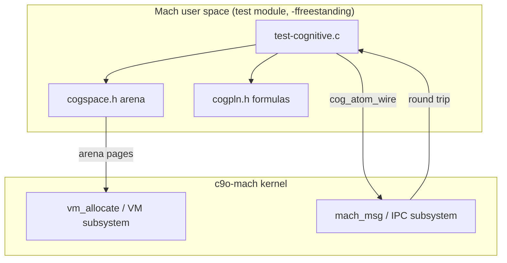
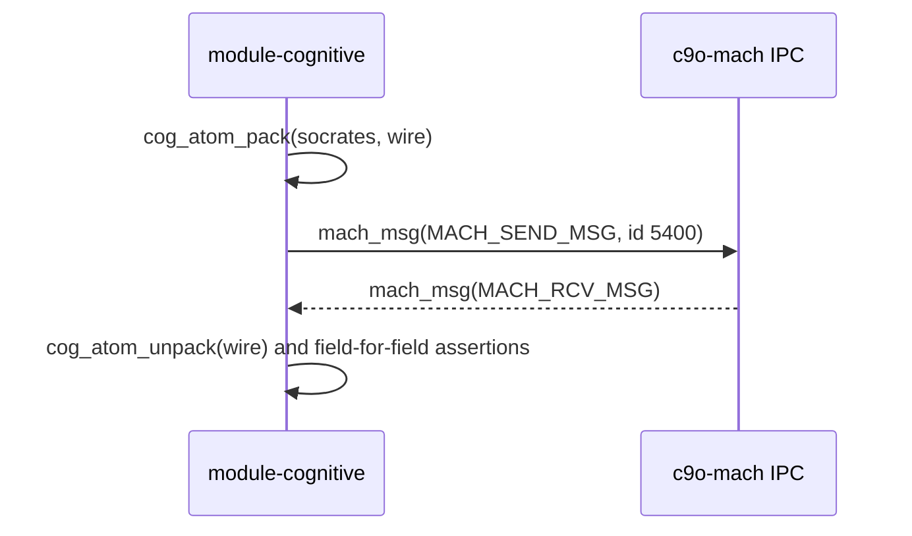

# CoGWXP-OS9 Integration Architecture

This document defines the integration between c9o-mach (GNU Mach) and the
CoGWXP-OS9 cognitive operating system project, records exactly what has been
implemented, and specifies the graduation path for deeper kernel-level
integration.

## 1. Status, Scope, and Provenance

CoGWXP-OS9 (github.com/o9nn/CoGWXP-OS9) describes itself as a cognitive AGI
platform unifying the Windows XP SP1 NT kernel source, the OpenCog framework
(AtomSpace, PLN, CogServer), Plan 9 (9P protocol), and Inferno-OS (Dis VM,
Limbo, Styx).

Ground truth of that repository as surveyed for this integration: of its 184
`.c` files, 152 are 125-190 byte stubs. The genuinely implemented core is
approximately 32 files: cogutil, a minimal AtomSpace, PLN truth-value
formulas, one monolithic TCP 9P server (`cogwxp/plan9/9p/9p.c`, including
`p9_server_set_atomspace`), a user-space cognitive scheduler
(`cogwxp/cogw7os/kernel/cogw7os.c`), and orchestration modules. The b9/p9/j9
bridge layer, the Inferno/Dis/Styx layer, and the modular 9P implementation
are stubs, and several headers describe APIs their implementations do not
provide.

Licensing: CoGWXP-OS9 embeds the leaked Windows XP SP1 source tree (XPSP1/)
and carries unclear licensing overall. It is therefore treated strictly as a
read-only reference corpus. No code crosses from CoGWXP-OS9 into GPLv2
c9o-mach. The cognitive primitives landed here (Section 2) are a clean-room
reimplementation of published Probabilistic Logic Networks mathematics whose
concrete parameterization was informed by reading, not copying, the reference
corpus.

Terminology: in this document "cognitive" refers to the concrete, tested
surface of Section 2, not to the decorative "Cognitive Flow / Tensor
Dimension" annotations already present in this repository's CI scripts.

## 2. What Was Integrated

The integration lands the smallest surface that is real, executable, and
falsifiable:

- `tests/include/cognitive/cogpln.h` -- fixed-point PLN truth-value
  formulas: deduction, revision (with the n/(n+K) count-to-confidence
  mapping, K = 800), modus ponens, conjunction, disjunction, negation.
- `tests/include/cognitive/cogspace.h` -- a minimal atomspace: typed named
  atoms, truth values, STI attention, incoming/outgoing sets, arena storage,
  and a fixed-layout wire struct for one atom in a `mach_msg` body.
- `tests/test-cognitive.c` -- a deterministic QEMU boot test proving the
  primitives on bare Mach: the atomspace lives in `vm_allocate` memory,
  inference results are asserted to exact integers, an atom crosses a Mach
  port round trip intact, and attention dynamics are exact.
- `scripts/validate-cognitive-primitives.sh` -- compile, boot, and
  consistency validation.

Layering:



Atom round trip over Mach IPC:



### Why fixed-point arithmetic

The test environment is `-ffreestanding -nolibc`: there is no float printf in
`kern/printf.c` and no FPU state guarantee for freestanding user modules.
Truth values are therefore fractions of `COG_TV_SCALE` (10000) with
documented rounding (multiply rounds half up; revision truncates). Numeric
compatibility with CoGWXP-OS9's floating-point implementation is explicitly
not claimed; the rounding rules bound the divergence.

## 3. Concept Mapping

The normative mapping between CoGWXP-OS9 concepts and c9o-mach surfaces.
"Future" rows are design intent, not implemented behavior.

| CoGWXP-OS9 concept | c9o-mach surface | Status |
|---|---|---|
| Atom (node/link) | `cog_atom` in a user task arena; handle is task-local | Implemented (tests) |
| AtomSpace region | `vm_allocate` arena today; memory object via external pager (`memory_object.defs`) later | Arena implemented |
| Truth value | `cog_tv_t` fixed-point strength/confidence/count | Implemented (tests) |
| Atom transport | `cog_atom_wire` inline in `mach_msg` body | Implemented (tests) |
| b9 terminal node | Mach port name | Mapping defined |
| p9 nested scope | Task plus registered port namespace (`mach_ports_register` / `mach_ports_lookup`) | Mapping defined |
| j9 gradient flow | Typed `mach_msg` stream; out-of-line descriptors for bulk tensors | Mapping defined |
| Agent inbox/outbox | Port set demultiplexing | Mapping defined |
| CogWXP 9P server | Future user-space server carrying its six implemented message types (Tversion, Tattach, Twalk, Topen, Tread, Tclunk) over Mach IPC; bare Mach tasks have no TCP, so network interop is not claimed | Future |
| CogW7OS attention scheduling | `thread_priority` / `thread_policy` advisories driven by STI; `register_new_task_notification` for task tracking | Future |
| Beast-mode STI loop | `perf_monitor` (subsystem 5200) as sensor, `kernel_feature` (subsystem 5300) as actuator | Future |

## 4. Invariants

Stated in precondition/postcondition style. The first three are enforced by
`tests/test-cognitive.c`; the fourth is future intent.

- ATOM_WIRE_ROUND_TRIP (tested): for any in-use atom `a`,
  `unpack(pack(a))` preserves type, name, strength, confidence, and STI.
- ATOM_HANDLE_STABILITY (tested): a handle returned by `cogspace_add_node`
  remains valid and resolves to the same atom for the life of the space.
- DETERMINISTIC_ATTENTION_ORDER (tested): `cogspace_top_sti` orders by STI
  descending with ties broken by ascending handle; `cogspace_decay` is an
  exact integer map.
- ATOM_PORT_IDENTITY_PRESERVATION (unverified, Phase 3): when atoms are
  served over an RPC interface, an atom's identity survives transfer of the
  serving port right.

## 5. Graduation Path (Phase 3)

Kernel-visible cognitive services must follow the repository's phased model:
new kernel RPC surfaces are Phase 3 work. The draft interface below is a
specification only; it is intentionally not compiled, and MIG subsystem 5400
is reserved for it (guarded by `scripts/validate-cognitive-primitives.sh`).
Prototyping should use `experimental.defs` before the number is claimed.

```
/* DRAFT -- not compiled. include/mach/cognitive.defs */
subsystem cognitive 5400;

routine cognitive_server_register(host: host_t; server: mach_port_t);
routine cognitive_server_unregister(host: host_t; server: mach_port_t);
routine cognitive_atom_publish(server: mach_port_t; wire: cog_atom_wire_t);
routine cognitive_atom_lookup(server: mach_port_t; name: cog_name_t;
                              out wire: cog_atom_wire_t);
routine cognitive_attention_set(server: mach_port_t; name: cog_name_t;
                                sti: int);
routine cognitive_attention_get(server: mach_port_t; name: cog_name_t;
                                out sti: int);
routine cognitive_get_stats(server: mach_port_t;
                            out atom_count: natural_t;
                            out link_count: natural_t);
```

Landing manifest for the graduation, modeled on the kernel_feature
(subsystem 5300) precedent. These files do not exist yet; they are the
Phase 3 work items:

```
include/mach/cognitive.defs        MIG interface definition
kern/cognitive.c, kern/cognitive.h Kernel-side service
kern/cognitive.srv                 Server stub generation input
kern/ipc_kobject.c                 Demux entry (edit)
Makefrag.am                        Build wiring (edit)
tests/test-cognitive-rpc.c         RPC-level boot test
scripts/validate-cognitive-interface.sh
docs/cognitive-interface.md
```

Acceptance criteria: kernel build and QEMU boot tests green on both i686 and
x86_64.

## 6. Non-Goals

- No kernel-resident AtomSpace: knowledge lives in user space.
- No 9P-over-TCP endpoint: bare Mach tasks have no network stack.
- No scheduler modifications: attention-driven scheduling remains advisory
  and future.
- No b9/p9/j9 bridge implementation: all seven bridge files in the reference
  corpus are stubs; implementing what its own authors have not is
  aspiration, not integration.
- No external services and no vendoring of CoGWXP-OS9 code.

## 7. Validation

- `make run-cognitive` in a configured build directory boots the test.
- `scripts/validate-cognitive-primitives.sh [build-dir]` runs the full
  compile, boot, and consistency suite.
- Reference sources consulted read-only: `cogwxp/opencog/pln/pln.c`,
  `cogwxp/opencog/atomspace/atomspace.c`, `cogwxp/plan9/9p/9p.c`,
  `.github/agents/AGI-OS-Integration.md` in the CoGWXP-OS9 repository.
