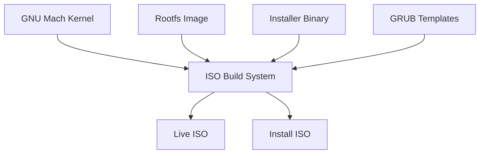
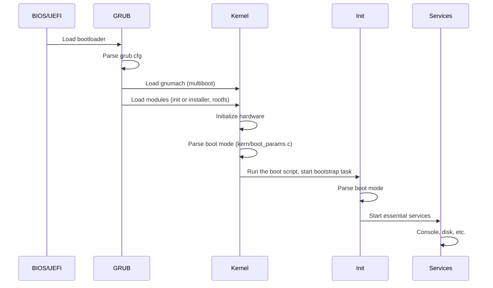

# c9o-mach Packaging Architecture

This document describes the architecture of the c9o-mach packaging system, which enables creating bootable ISO images and installer binaries.

## Overview

The packaging system creates:
1. **Live ISO** - Boot directly into c9o-mach from RAM
2. **Installation ISO** - Install c9o-mach to a hard drive
3. **Installer binary** - Standalone installation program



## Directory Structure

The build rules live in the top level `Makefile.am`, following the
non-recursive layout used by the rest of the tree.

```
packaging/
├── iso/
│   ├── build-iso.sh             # ISO creation script
│   ├── grub.cfg.live.template   # GRUB config for live boot
│   └── grub.cfg.install.template # GRUB config for installer
├── rootfs/
│   └── build-rootfs.sh          # Root filesystem image builder
└── installer/
    ├── installer.h              # Installer header
    ├── main.c                   # Installer entry point
    ├── disk.c                   # Disk operations
    ├── partition.c              # Partition management
    ├── filesystem.c             # Filesystem creation
    ├── bootloader.c             # Bootloader installation
    ├── ui.c                     # Text-based UI
    └── utils.c                  # Utility functions

init/
├── init.h                       # Init system header
├── main.c                       # Init entry point
└── services.c                   # Service management
```

## ISO Layout

### Standard Layout

```
ISO Root/
├── boot/
│   ├── grub/
│   │   ├── grub.cfg            # GRUB configuration
│   │   ├── fonts/              # GRUB fonts
│   │   └── i386-pc/            # GRUB modules (BIOS)
│   ├── gnumach                 # The kernel
│   ├── init                    # Bootstrap task (built as c9o-init)
│   └── modules/
│       ├── rootfs.img          # Root filesystem image
│       └── installer           # Installer binary (install ISO only)
├── EFI/
│   └── BOOT/
│       └── BOOTX64.EFI         # UEFI bootloader
└── [isolinux/]                  # Legacy BIOS fallback (optional)
```

### Boot Process



### Boot Parameters

The kernel command line selects the environment to boot.  The parsing
helpers in `kern/boot_params.[ch]` are shared by the kernel, `init` and
the installer, so all three agree on what a parameter means:

| Parameter | Meaning |
|-----------|---------|
| `live` | Live environment, run from RAM |
| `install` | Installation environment |
| `rescue` | Minimal rescue environment |
| `single`, `-s` | Single user mode |
| `target=DEVICE` | Installation target device |
| `unattended` | Allow the installer to write to the target disk |

`install` takes precedence over `rescue`, which takes precedence over
`live`.  The kernel reports the result early in the boot log:

```
[0.000] boot mode: live
```

### Module Lines Are Boot Script Commands

GNU Mach does not treat multiboot modules as plain files: every module
string is a line of the boot script, where the first word names the
program and the rest becomes its argument vector, see `kern/bootstrap.c`
and `kern/boot_script.c`.  A GRUB menu entry therefore starts `init`
with the ports and the command line it needs:

```
module /boot/init init '${host-port}' '${device-port}' '${kernel-command-line}' '$(task-create)' '$(task-resume)'
```

Data modules must not be executed, so they are declared as a boot script
comment:

```
module /boot/modules/rootfs.img '#rootfs'
```

## Build System Integration

### Configure Options

New `configure.ac` options:

```m4
AC_ARG_ENABLE([installer],
  AS_HELP_STRING([--enable-installer], [Build the installer binary]),
  [enable_installer=$enableval],
  [enable_installer=no])

AC_ARG_ENABLE([live-iso],
  AS_HELP_STRING([--enable-live-iso], [Enable live ISO building]),
  [enable_live_iso=$enableval],
  [enable_live_iso=no])

AC_ARG_WITH([rootfs],
  AS_HELP_STRING([--with-rootfs=TYPE], [Rootfs type: minimal or full]),
  [rootfs_type=$withval],
  [rootfs_type=minimal])
```

### Makefile Targets

```makefile
# Build targets
iso:                 # Default ISO (same as iso-live)
iso-live:            # Live boot ISO
iso-install:         # Installation ISO
iso-full:            # Both live and install
iso-all:             # All configured ISOs
iso-clean:           # Remove ISO build artifacts

# Component targets
c9o-init:            # Build the init bootstrap task
installer:           # Build installer binary
rootfs.img:          # Build rootfs image

# Testing targets
iso-validate:        # Check ISO structure without booting
iso-test:            # Boot the ISO in QEMU and wait for the ready marker
iso-live-test:       # Build and boot test the live ISO
iso-install-test:    # Build and boot test the install ISO
```

The ISOs are named `c9o-mach-<type>-<arch>.iso`, for instance
`c9o-mach-live-i686.iso`, and are written next to the kernel in the build
directory together with a `.sha256` file.

## Installer Architecture

### Module Structure

```
                    ┌─────────────────────────────────────────┐
                    │                main.c                    │
                    │         Entry point & flow control       │
                    └─────────────┬───────────────────────────┘
                                  │
        ┌─────────────────────────┼─────────────────────────┐
        │                         │                         │
        ▼                         ▼                         ▼
┌───────────────┐       ┌───────────────┐       ┌───────────────┐
│     ui.c      │       │    disk.c     │       │  bootloader.c │
│  Text-based   │       │    Disk       │       │   GRUB        │
│  interface    │       │  operations   │       │ installation  │
└───────┬───────┘       └───────┬───────┘       └───────────────┘
        │                       │
        │               ┌───────┴───────┐
        │               │               │
        │               ▼               ▼
        │       ┌───────────────┐ ┌───────────────┐
        │       │ partition.c   │ │ filesystem.c  │
        │       │  Partition    │ │  Filesystem   │
        │       │  management   │ │  creation     │
        │       └───────────────┘ └───────────────┘
        │
        └──────────────────────────────────────────────────────┐
                                                               │
                    ┌─────────────────────────────────────────┐│
                    │               utils.c                    ││
                    │    Logging, formatting, helpers          │◄┘
                    └─────────────────────────────────────────┘
```

### Disk Operations

```c
// Enumerate available disks
disk_info_t *disk_enumerate(void);

// Read/write sectors
int disk_read_sectors(disk_info_t *disk, uint64_t start, 
                      uint64_t count, void *buffer);
int disk_write_sectors(disk_info_t *disk, uint64_t start, 
                       uint64_t count, const void *buffer);
```

### Partition Management

```c
// Create partition table
int partition_create_table(disk_info_t *disk, ptable_type_t type);

// Create partition
int partition_create(disk_info_t *disk, uint64_t start, 
                     uint64_t size, partition_type_t type);

// Automatic partitioning
int partition_auto_layout(disk_info_t *disk, partition_config_t *config);
```

### Filesystem Support

| Type | Read | Write | Create |
|------|------|-------|--------|
| ext2 | ✓ | ✓ | ✓ |
| ext3/4 | ✓ | ✓ | Partial |
| FAT32 | ✓ | ✓ | Planned |
| swap | N/A | N/A | ✓ |

## Init System

### Boot Modes

| Mode | Description | Services Started |
|------|-------------|------------------|
| `normal` | Standard boot | All services |
| `live` | RAM-based live | Console, network |
| `install` | Installation mode | Console, installer |
| `rescue` | Minimal rescue | Console only |
| `single` | Single user | Console only |

### Service Management

```c
// Service lifecycle
int service_start(const char *name);
int service_stop(const char *name);
int service_restart(const char *name);

// Bulk operations
void services_start_all(void);
void services_stop_all(void);
```

### Built-in Services

| Service | Description | Type |
|---------|-------------|------|
| console | Console access | daemon |
| disk | Disk service | daemon |
| network | Network (pfinet) | daemon |
| auth | Authentication | daemon |
| proc | Process server | daemon |

## Testing Infrastructure

### Validation Scripts

```bash
# Validate ISO structure
scripts/validate-iso.sh c9o-mach-live-i686.iso

# Test boot in QEMU
scripts/validate-iso.sh --boot-test c9o-mach-live-i686.iso

# Test UEFI boot
scripts/validate-iso.sh --boot-test --efi c9o-mach-live-x86_64.iso
```

The boot test is deterministic: it waits for the readiness marker printed
by the bootstrap task (`c9o-mach-init-ready` or
`c9o-mach-installer-ready`), and fails on a kernel panic or when the
marker does not appear before the timeout.

### CI/CD Integration

```yaml
# GitHub Actions workflow addition
- name: Build kernel
  env:
    EXTRA_CONFIGURE_FLAGS: "--enable-live-iso --enable-installer --enable-install-iso"
  run: ./scripts/ci-build.sh i686

- name: Build ISOs
  working-directory: build-i686
  run: |
    make iso-live
    make iso-install

- name: Test ISOs
  run: |
    for iso in build-i686/*.iso; do
      scripts/validate-iso.sh --boot-test "$iso"
    done
```

`scripts/ci-build.sh` is used instead of a plain `./configure` because it
also builds MIG with the ABI of the target, which both the kernel and the
bootstrap tasks on the media depend on.

## Extending the System

### Adding New Filesystem Support

1. Add filesystem type to `installer.h`:
   ```c
   typedef enum {
       FS_TYPE_NONE = 0,
       FS_TYPE_EXT2,
       FS_TYPE_EXT3,
       FS_TYPE_NEW_FS,  // Add new type
       ...
   } filesystem_type_t;
   ```

2. Implement creation in `filesystem.c`:
   ```c
   static int fs_create_newfs(disk_info_t *disk, 
                              partition_info_t *part, 
                              const char *label)
   {
       // Implementation
   }
   ```

3. Add case in `fs_create()`:
   ```c
   case FS_TYPE_NEW_FS:
       result = fs_create_newfs(disk, target, label);
       break;
   ```

### Adding New Services

1. Register in `services_init()`:
   ```c
   service_register("newservice", "/path/to/service", SERVICE_TYPE_DAEMON);
   ```

2. Services are automatically managed by the init system.

### Custom ISO Configurations

The GRUB templates are copied to the ISO as they are, so a custom
configuration is a matter of editing them and rebuilding:

```bash
$EDITOR packaging/iso/grub.cfg.live.template
make iso-live
```

`packaging/iso/build-iso.sh` can also be run directly, for instance to
assemble an ISO from binaries that were built elsewhere:

```bash
packaging/iso/build-iso.sh --type live --arch i686 \
    --kernel build-i686/gnumach --init build-i686/c9o-init \
    --rootfs build-i686/rootfs.img --output .
```

## Future Enhancements

### Planned Features

- [ ] GPT partition table support
- [ ] UEFI bootloader installation
- [ ] Network installation support
- [ ] Graphical installer (future)
- [ ] Package management integration
- [ ] Secure Boot support

### Architecture Improvements

- [ ] Modular driver loading
- [ ] Compressed rootfs support
- [ ] Delta update support
- [ ] Recovery partition

---

*For more information, see the [Installation Guide](installation-guide.md) and [Development Guide](../CONTRIBUTING.md).*
