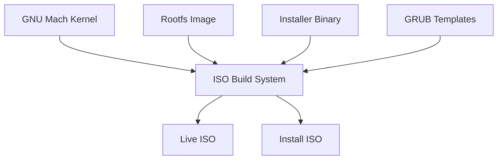
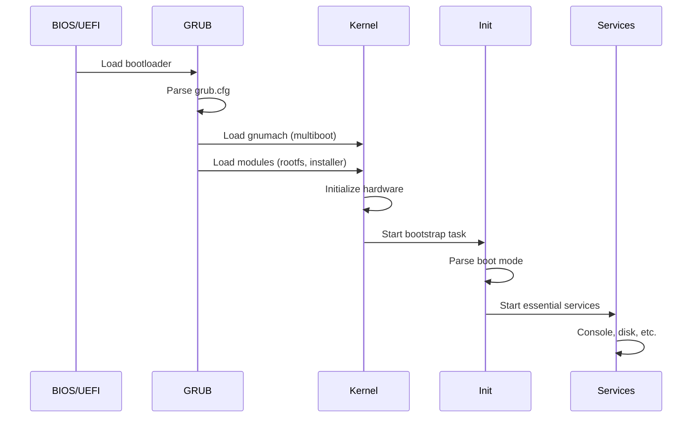

# c9o-mach Packaging Architecture

This document describes the architecture of the c9o-mach packaging system, which enables creating bootable ISO images and installer binaries.

## Overview

The packaging system creates:
1. **Live ISO** - Boot directly into c9o-mach from RAM
2. **Installation ISO** - Install c9o-mach to a hard drive
3. **Installer binary** - Standalone installation program



## Directory Structure

```
packaging/
├── iso/
│   ├── Makefile.am              # ISO build rules
│   ├── build-iso.sh             # ISO creation script
│   ├── grub.cfg.live.template   # GRUB config for live boot
│   └── grub.cfg.install.template # GRUB config for installer
├── rootfs/
│   ├── minimal/                 # Minimal root filesystem
│   └── full/                    # Full distribution rootfs
└── installer/
    ├── Makefile.am              # Installer build rules
    ├── installer.h              # Installer header
    ├── main.c                   # Installer entry point
    ├── disk.c                   # Disk operations
    ├── partition.c              # Partition management
    ├── filesystem.c             # Filesystem creation
    ├── bootloader.c             # Bootloader installation
    ├── ui.c                     # Text-based UI
    └── utils.c                  # Utility functions

init/
├── init.h                       # Init system header
├── main.c                       # Init entry point
└── services.c                   # Service management
```

## ISO Layout

### Standard Layout

```
ISO Root/
├── boot/
│   ├── grub/
│   │   ├── grub.cfg            # GRUB configuration
│   │   ├── fonts/              # GRUB fonts
│   │   └── i386-pc/            # GRUB modules (BIOS)
│   ├── gnumach                 # The kernel
│   └── modules/
│       ├── rootfs.img          # Root filesystem image
│       └── installer           # Installer binary (install ISO only)
├── EFI/
│   └── BOOT/
│       └── BOOTX64.EFI         # UEFI bootloader
└── [isolinux/]                  # Legacy BIOS fallback (optional)
```

### Boot Process



## Build System Integration

### Configure Options

New `configure.ac` options:

```m4
AC_ARG_ENABLE([installer],
  AS_HELP_STRING([--enable-installer], [Build the installer binary]),
  [enable_installer=$enableval],
  [enable_installer=no])

AC_ARG_ENABLE([live-iso],
  AS_HELP_STRING([--enable-live-iso], [Enable live ISO building]),
  [enable_live_iso=$enableval],
  [enable_live_iso=no])

AC_ARG_WITH([rootfs],
  AS_HELP_STRING([--with-rootfs=TYPE], [Rootfs type: minimal or full]),
  [rootfs_type=$withval],
  [rootfs_type=minimal])
```

### Makefile Targets

```makefile
# Build targets
iso:                 # Default ISO (same as iso-live)
iso-live:            # Live boot ISO
iso-install:         # Installation ISO
iso-live-i686:       # Live ISO for i686
iso-live-x86_64:     # Live ISO for x86_64
iso-install-i686:    # Install ISO for i686
iso-install-x86_64:  # Install ISO for x86_64
iso-full:            # Both live and install
iso-all:             # All ISOs for all architectures

# Component targets
installer:           # Build installer binary
rootfs.img:          # Build rootfs image

# Testing targets
iso-test:            # Test ISO in QEMU (BIOS)
iso-test-efi:        # Test ISO in QEMU (UEFI)
install-test:        # Test installation process
```

## Installer Architecture

### Module Structure

```
                    ┌─────────────────────────────────────────┐
                    │                main.c                    │
                    │         Entry point & flow control       │
                    └─────────────┬───────────────────────────┘
                                  │
        ┌─────────────────────────┼─────────────────────────┐
        │                         │                         │
        ▼                         ▼                         ▼
┌───────────────┐       ┌───────────────┐       ┌───────────────┐
│     ui.c      │       │    disk.c     │       │  bootloader.c │
│  Text-based   │       │    Disk       │       │   GRUB        │
│  interface    │       │  operations   │       │ installation  │
└───────┬───────┘       └───────┬───────┘       └───────────────┘
        │                       │
        │               ┌───────┴───────┐
        │               │               │
        │               ▼               ▼
        │       ┌───────────────┐ ┌───────────────┐
        │       │ partition.c   │ │ filesystem.c  │
        │       │  Partition    │ │  Filesystem   │
        │       │  management   │ │  creation     │
        │       └───────────────┘ └───────────────┘
        │
        └──────────────────────────────────────────────────────┐
                                                               │
                    ┌─────────────────────────────────────────┐│
                    │               utils.c                    ││
                    │    Logging, formatting, helpers          │◄┘
                    └─────────────────────────────────────────┘
```

### Disk Operations

```c
// Enumerate available disks
disk_info_t *disk_enumerate(void);

// Read/write sectors
int disk_read_sectors(disk_info_t *disk, uint64_t start, 
                      uint64_t count, void *buffer);
int disk_write_sectors(disk_info_t *disk, uint64_t start, 
                       uint64_t count, const void *buffer);
```

### Partition Management

```c
// Create partition table
int partition_create_table(disk_info_t *disk, ptable_type_t type);

// Create partition
int partition_create(disk_info_t *disk, uint64_t start, 
                     uint64_t size, partition_type_t type);

// Automatic partitioning
int partition_auto_layout(disk_info_t *disk, partition_config_t *config);
```

### Filesystem Support

| Type | Read | Write | Create |
|------|------|-------|--------|
| ext2 | ✓ | ✓ | ✓ |
| ext3/4 | ✓ | ✓ | Partial |
| FAT32 | ✓ | ✓ | Planned |
| swap | N/A | N/A | ✓ |

## Init System

### Boot Modes

| Mode | Description | Services Started |
|------|-------------|------------------|
| `normal` | Standard boot | All services |
| `live` | RAM-based live | Console, network |
| `install` | Installation mode | Console, installer |
| `rescue` | Minimal rescue | Console only |
| `single` | Single user | Console only |

### Service Management

```c
// Service lifecycle
int service_start(const char *name);
int service_stop(const char *name);
int service_restart(const char *name);

// Bulk operations
void services_start_all(void);
void services_stop_all(void);
```

### Built-in Services

| Service | Description | Type |
|---------|-------------|------|
| console | Console access | daemon |
| disk | Disk service | daemon |
| network | Network (pfinet) | daemon |
| auth | Authentication | daemon |
| proc | Process server | daemon |

## Testing Infrastructure

### Validation Scripts

```bash
# Validate ISO structure
scripts/validate-iso.sh c9o-mach-live-i686.iso

# Test boot in QEMU
scripts/validate-iso.sh --boot-test c9o-mach-live-i686.iso

# Test UEFI boot
scripts/validate-iso.sh --boot-test --efi c9o-mach-live-x86_64.iso
```

### CI/CD Integration

```yaml
# GitHub Actions workflow addition
- name: Build ISOs
  run: |
    make iso-live
    make iso-install

- name: Test ISOs
  run: |
    scripts/validate-iso.sh --boot-test *.iso
```

## Extending the System

### Adding New Filesystem Support

1. Add filesystem type to `installer.h`:
   ```c
   typedef enum {
       FS_TYPE_NONE = 0,
       FS_TYPE_EXT2,
       FS_TYPE_EXT3,
       FS_TYPE_NEW_FS,  // Add new type
       ...
   } filesystem_type_t;
   ```

2. Implement creation in `filesystem.c`:
   ```c
   static int fs_create_newfs(disk_info_t *disk, 
                              partition_info_t *part, 
                              const char *label)
   {
       // Implementation
   }
   ```

3. Add case in `fs_create()`:
   ```c
   case FS_TYPE_NEW_FS:
       result = fs_create_newfs(disk, target, label);
       break;
   ```

### Adding New Services

1. Register in `services_init()`:
   ```c
   service_register("newservice", "/path/to/service", SERVICE_TYPE_DAEMON);
   ```

2. Services are automatically managed by the init system.

### Custom ISO Configurations

Create a custom GRUB template:

```bash
cp packaging/iso/grub.cfg.live.template packaging/iso/grub.cfg.custom.template
# Edit as needed
```

Build with custom config:

```bash
GRUB_CFG=grub.cfg.custom.template make iso-live
```

## Future Enhancements

### Planned Features

- [ ] GPT partition table support
- [ ] UEFI bootloader installation
- [ ] Network installation support
- [ ] Graphical installer (future)
- [ ] Package management integration
- [ ] Secure Boot support

### Architecture Improvements

- [ ] Modular driver loading
- [ ] Compressed rootfs support
- [ ] Delta update support
- [ ] Recovery partition

---

*For more information, see the [Installation Guide](installation-guide.md) and [Development Guide](../CONTRIBUTING.md).*
